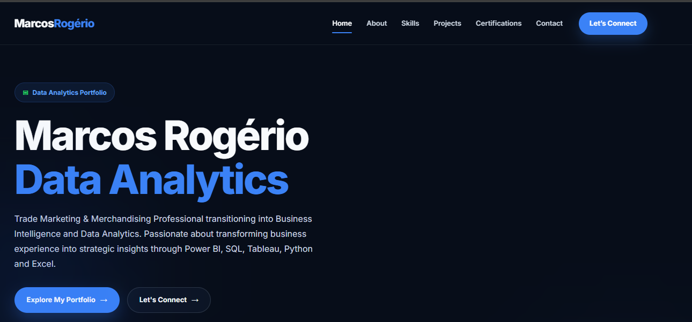

# 🌐 Marcos Rogério | Data Analytics Portfolio Website

<p align="center">
  
</p>

<p align="center">


</p>

<p align="center">

### Trade Marketing & Merchandising Professional transitioning into Business Intelligence and Data Analytics.

Building practical Business Intelligence solutions with **Power BI, SQL, Tableau, JavaScript and modern web technologies.**

</p>

---

# 🌍 Live Website

### 🔗 https://marcosrdevbr.github.io

Experience the complete multilingual portfolio online.

---

# 📌 Overview

This portfolio was designed as my professional online presence, bringing together Business Intelligence projects, technical certifications, analytical skills and my career transition into Data Analytics.

More than a personal website, this project demonstrates my continuous learning journey and my commitment to building practical, business-oriented analytical solutions.

The portfolio was developed from scratch using **HTML, CSS and Vanilla JavaScript**, with a strong focus on performance, responsiveness, accessibility and clean user experience.

---

# 🚀 Highlights

- 🌍 Multilingual Portfolio (English • Portuguese • Simplified Chinese)
- 📁 14 Business Intelligence & Data Analytics Projects
- 📊 Power BI Dashboards
- 📈 Tableau Dashboards
- 🗄 SQL Analytics Projects
- 💻 Built with HTML, CSS and Vanilla JavaScript
- 📱 Fully Responsive Design
- ⚡ Dynamic Project Filtering
- 🎓 Professional Certifications
- 🏅 Technical Badges
- 🚀 Hosted on GitHub Pages

---

# ✨ Features

## 🌍 Multilingual Experience

- English
- Portuguese (Brazil)
- Simplified Chinese

Language switching happens instantly without page reload.

---

## 🎨 Modern User Interface

- Modern Layout
- Clean Design
- Smooth Animations
- Glassmorphism Elements
- Interactive Cards
- Professional Typography

---

## 📱 Responsive Design

Optimized for:

- Desktop
- Laptop
- Tablet
- Mobile Devices

---

## 📊 Portfolio Projects

- Featured Projects Section
- Complete Projects Gallery
- Dynamic Project Cards
- Project Filtering by Technology
- GitHub Repository Integration

---

## 💼 Professional Sections

- Hero
- About Me
- Skills
- Featured Projects
- Complete Portfolio
- Certifications
- Technical Badges
- Contact
- Footer

---

## ⚙️ User Experience

- Smooth Scroll Navigation
- Active Navigation Menu
- Animated Sections
- Back-to-Top Button
- Interactive Hover Effects
- Certificate Preview Modal
- Optimized Performance

---

# 🛠 Technologies Used

### Front-End

- HTML5
- CSS3
- Vanilla JavaScript

### Development

- Git
- GitHub
- GitHub Pages

### Data Analytics

- Power BI
- SQL
- Tableau
- Excel
- Python

  ---

# 📂 Project Structure

```text
Portfolio-Website/

│
├── assets/
│   │
│   ├── css/
│   │   └── style.css
│   │
│   ├── documents/
│   │
│   ├── images/
│   │   ├── certifications/
│   │   ├── projects/
│   │   ├── portfolio-banner.png
│   │   └── profile.png
│   │
│   ├── js/
│   │   ├── script.js
│   │   ├── projects.js
│   │   ├── certifications.js
│   │   └── language.js
│   │
│   └── translations/
│       ├── en.js
│       ├── pt-BR.js
│       └── zh-CN.js
│
├── index.html
├── projects.html
└── README.md
```

---

# 📸 Website Sections

## 🏠 Hero

The landing section introduces my professional profile with a modern visual presentation.

Features include:

- Professional Introduction
- Dynamic Statistics
- Call-to-Action Buttons
- Profile Image
- Smooth Entrance Animations

---

## 👤 About

A concise overview of my professional journey, highlighting more than 20 years of experience in Trade Marketing & Merchandising and my transition into Business Intelligence and Data Analytics.

---

## 💻 Technical Skills

Technologies currently featured:

- Power BI
- SQL
- Tableau
- Python
- Excel
- HTML5
- CSS3
- JavaScript
- Git
- GitHub

Each technology includes a visual proficiency indicator.

---

## 📊 Featured Projects

A curated selection of my primary Business Intelligence projects.

Includes:

- Power BI Dashboards
- Tableau Dashboards
- SQL Analytics
- Portfolio Website

---

## 📁 Complete Projects Gallery

Dedicated page displaying all portfolio projects.

Features:

- Dynamic Project Cards
- Technology Filters
- GitHub Integration
- Responsive Grid Layout
- Multilingual Content
- Project Statistics

---

## 🎓 Certifications

Professional certifications from internationally recognized learning platforms.

Current providers include:

- Cisco Networking Academy
- Fundação Bradesco

The section also includes digital badges and certificate preview functionality.

---

## 📬 Contact

Quick access to my professional channels:

- LinkedIn
- GitHub
- Tableau Public
- Email

Visitors can easily connect or explore additional projects.

---

# 🌍 Multilingual Architecture

The portfolio supports three languages:

- 🇺🇸 English
- 🇧🇷 Portuguese (Brazil)
- 🇨🇳 Simplified Chinese

Translations are dynamically loaded using Vanilla JavaScript, allowing instant language switching without reloading the page.

Translation files:

```text
assets/translations/

en.js
pt-BR.js
zh-CN.js
```

Language management is handled through:

```text
assets/js/language.js
```

---

# ⚙️ Technical Highlights

The project was developed following a modular architecture.

Main components include:

- Modular JavaScript files
- Dynamic project rendering
- Dynamic certification rendering
- Language management system
- Responsive layout
- CSS animations
- Component-based organization

---

# 📱 Responsive Design

The website was designed using a mobile-first responsive approach.

Optimized for:

- Desktop
- Laptop
- Tablet
- Mobile

All sections automatically adapt to different screen sizes while maintaining usability and visual consistency.

---

# 🚀 Deployment

The portfolio is deployed using **GitHub Pages**, ensuring fast loading times and reliable hosting.

Live Website:

**https://marcosrdevbr.github.io**

Source Code:

**https://github.com/marcosrdevbr/marcosrdevbr.github.io**

---

# 📈 Current Portfolio Statistics

- 🌍 3 Languages
- 📁 14 Portfolio Projects
- 📊 Power BI Dashboards
- 📈 Tableau Dashboards
- 🗄 SQL Projects
- 🎓 3 Professional Certifications
- 🏅 2 Technical Badges
- 💻 9+ Technologies
- 📱 100% Responsive Design
- ⚡ Dynamic JavaScript Components

---

# 👨🏾‍💻 About the Author

Hi! I'm **Marcos Rogério**, a Trade Marketing & Merchandising professional with more than **20 years of experience**, currently transitioning into **Business Intelligence** and **Data Analytics**.

Throughout my career, I have led commercial initiatives, retail execution, field teams, performance analysis and strategic business projects.

Today, I focus on transforming data into actionable business insights through practical projects developed with:

- 📊 Power BI
- 🗄 SQL
- 📈 Tableau
- 🐍 Python
- 📑 Excel
- 🌐 HTML, CSS & JavaScript

This portfolio represents my continuous learning journey and my commitment to building business-oriented analytical solutions.

---

# 🎯 Professional Goals

My goal is to contribute to organizations by transforming complex data into clear, meaningful and actionable insights that support strategic decision-making.

I am continuously improving my technical and analytical skills while building real-world portfolio projects that demonstrate practical Business Intelligence and Data Analytics solutions.

---

# 🌟 What You'll Find Here

This portfolio includes projects focused on:

- Business Intelligence
- Data Analytics
- Interactive Dashboards
- KPI Monitoring
- SQL Analysis
- Data Visualization
- Business Storytelling
- Portfolio Website Development

Each project has been designed to simulate real business scenarios while applying industry best practices.

---

# 📫 Connect with Me

### 🌐 Portfolio

**https://marcosrdevbr.github.io**

### 💼 LinkedIn: https://www.linkedin.com/in/marcos-rogerio-017923302/

### 💻 GitHub: https://github.com/marcosrdevbr

### 📊 Tableau Public: https://public.tableau.com/app/profile/marcos.rogerio5761

### 📧 Email: thebestofblack@gmail.com

---

# ⭐ Support This Project

If you enjoyed this portfolio or found it useful, consider giving this repository a ⭐ on GitHub.

Your support helps increase the visibility of my work and motivates me to continue building new Business Intelligence and Data Analytics projects.

Feedback, suggestions and professional connections are always welcome.

---

# 📄 License

This repository is intended for **portfolio and educational purposes**.

You are welcome to explore the source code for learning and reference.

Please respect the originality of the project.

Unauthorized copying, redistribution or reproduction of the design, branding, visual identity or content is prohibited.

---

# 🙏🏾 Acknowledgements

Special thanks to the open-source community and to the many professionals who share knowledge, helping developers and data professionals grow every day.

Continuous learning is one of the foundations of this portfolio.

---

# 🚀 Portfolio Roadmap

Future improvements may include:

- SEO optimization
- Performance improvements
- Progressive Web App (PWA)
- Blog integration
- Interactive case studies
- Dark / Light theme
- Advanced search
- Additional languages
- Accessibility enhancements

---

<p align="center">

**Built with ❤️ using HTML5, CSS3, Vanilla JavaScript and GitHub Pages.**

</p>

---

<p align="center">

© 2026 **Marcos Rogério**. All rights reserved.

This project is intended for portfolio and educational purposes only.

The source code is available for learning and inspiration.

Copying or reproducing the design, branding, visual identity or content without prior written permission is prohibited.

</p>
