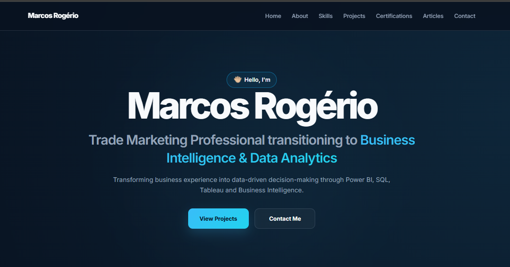

# 🌐 Marcos Rogério | Data Analytics Portfolio

<p align="center">
 
</p>

<p align="center">


</p>

<p align="center">
A modern and responsive portfolio built to showcase my Business Intelligence and Data Analytics projects, technical articles, and professional journey.
</p>

---

## 🌐 Live Website

🔗 **Portfolio:**  
https://marcosrdevbr.github.io/

---

## 📌 About

This repository contains my personal portfolio website, developed from scratch using **HTML**, **CSS**, and **JavaScript**.

The portfolio was designed to provide a central hub where recruiters, hiring managers, and professionals can explore:

- 📊 Data Analytics projects
- 📈 Business Intelligence dashboards
- 💻 GitHub repositories
- 📖 Technical articles published on Substack
- 📊 Tableau Public dashboards
- 💼 Professional profile and contact information

The goal is to present both my technical skills and my transition journey from **Trade Marketing** to **Business Intelligence & Data Analytics**.

---

## ✨ Features

- Responsive design
- Modern user interface
- Featured Projects section
- Complete Projects gallery
- Individual project pages
- Technical Writing section
- Integrated contact cards
- GitHub Pages deployment
- Smooth animations and transitions

---

## 🛠️ Technologies Used

- HTML5
- CSS3
- JavaScript (Vanilla)
- GitHub Pages

---

## 📂 Website Structure

```text
Home
│
├── About
├── Skills
├── Featured Projects
├── Technical Writing
├── Contact
└── Footer

Projects
│
├── All Projects
└── Project Details
```

---

## 🚀 Featured Sections

### 📊 Featured Projects

A curated selection of Business Intelligence and Data Analytics projects developed using:

- Power BI
- Tableau
- SQL
- Excel

---

### 📖 Technical Writing

Technical articles documenting:

- Project development
- Business insights
- Dashboard design
- Data storytelling
- Lessons learned
- Career transition

Published on **Substack**.

---

### 📬 Contact

The website provides quick access to my professional platforms:

- GitHub
- LinkedIn
- Tableau Public
- Substack

---

## 📷 Preview

> Add a screenshot of the homepage here.

```
Images/portfolio-preview.png
```

---

## 🚀 Future Improvements

- Blog integration
- Dark/Light theme switch
- Search and filtering enhancements
- Additional project categories
- Interactive animations

---

## 🤝 Connect With Me

- 💻 GitHub: https://github.com/marcosrdevbr
- 💼 LinkedIn: [https://www.linkedin.com/in/SEU-LINKEDIN](https://www.linkedin.com/in/marcos-rog%C3%A9rio-017923302/)
- 📊 Tableau Public: [https://public.tableau.com/app/profile/SEU-PERFIL](https://public.tableau.com/app/profile/marcos.rogerio5761/vizzes)
- 📖 Substack: [https://SEU-PERFIL.substack.com](https://substack.com/@marcosrogerio1978)

---

## 📄 License

This project is available for learning and portfolio inspiration.

Please do not copy the design or content without permission.

---

## © 2026 Marcos Rogério

Built with **HTML**, **CSS** & **JavaScript**.

Designed & Developed by **Marcos Rogério**.
